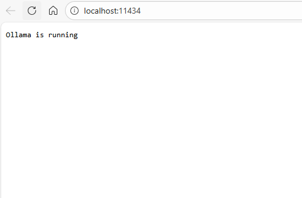
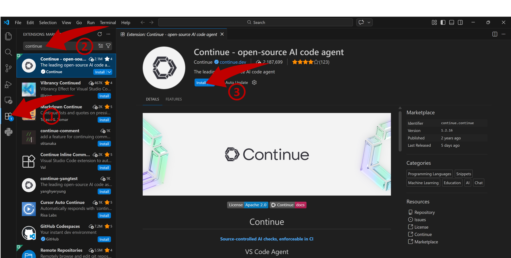
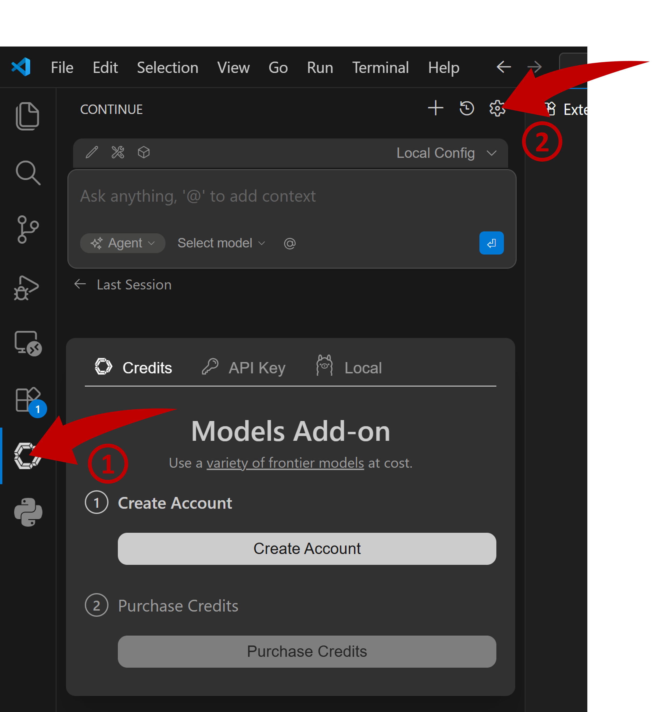
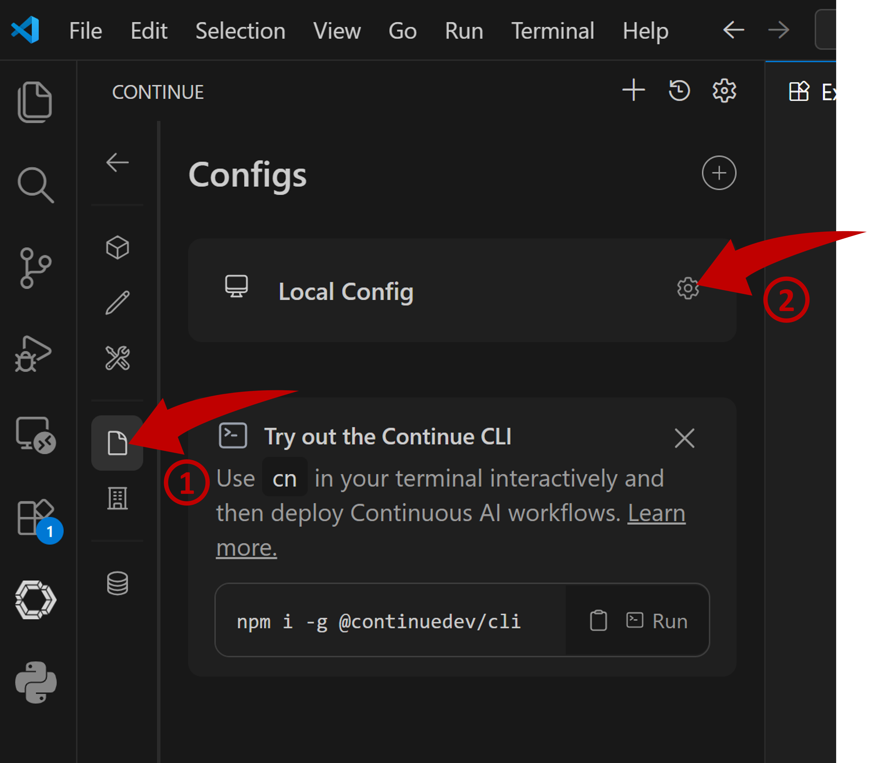
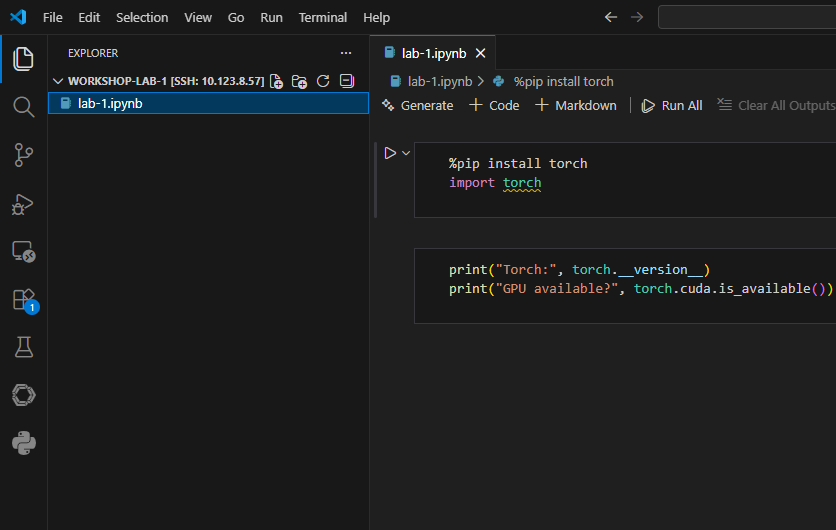
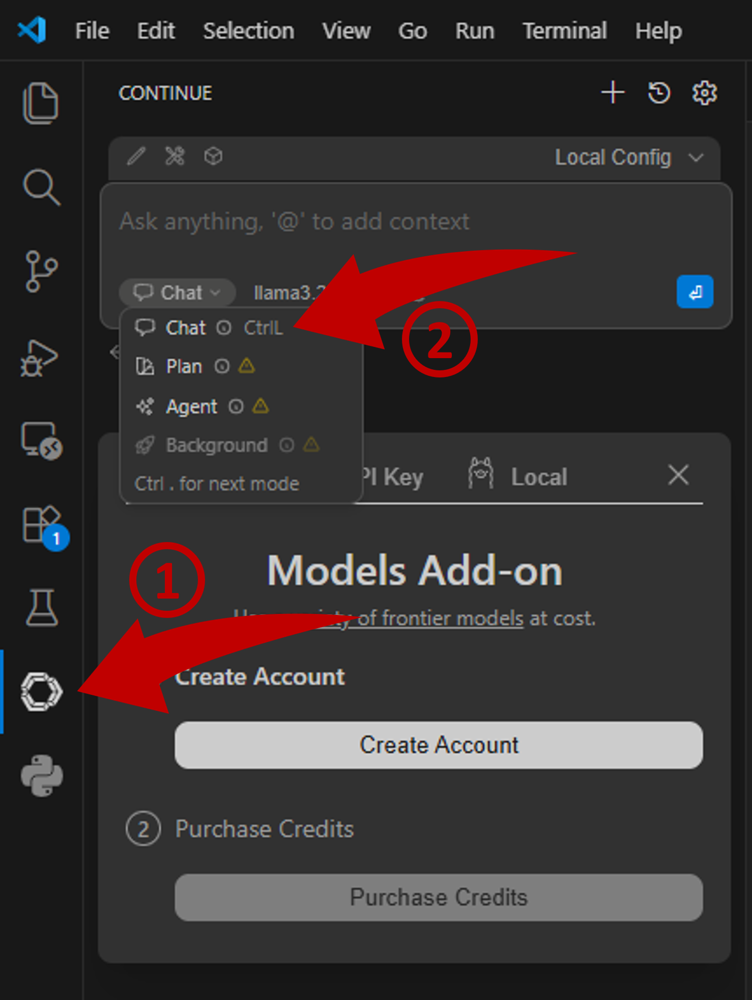
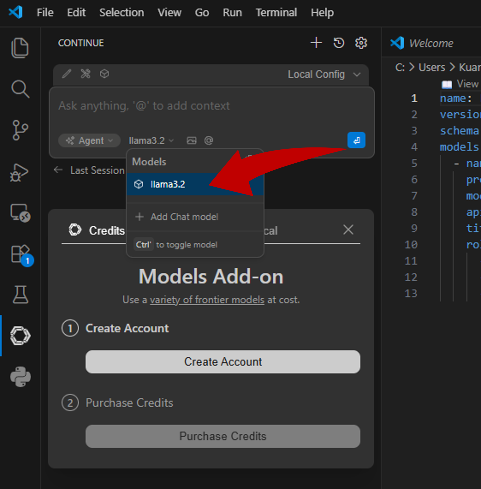
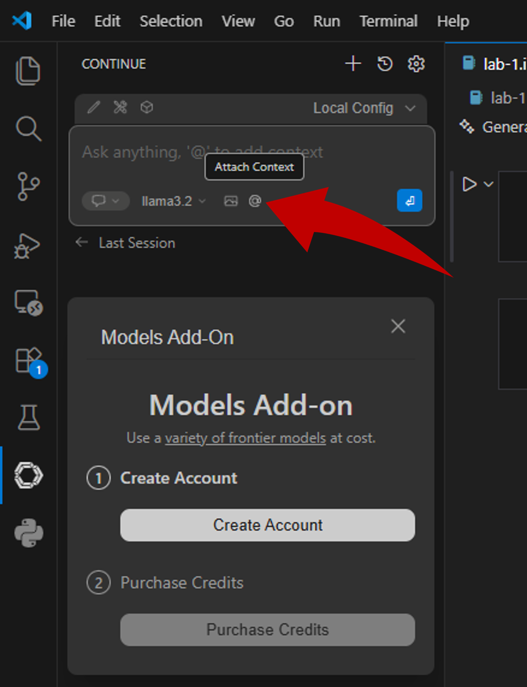
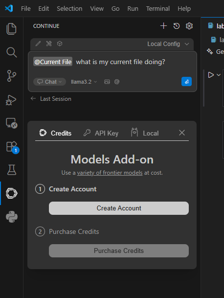
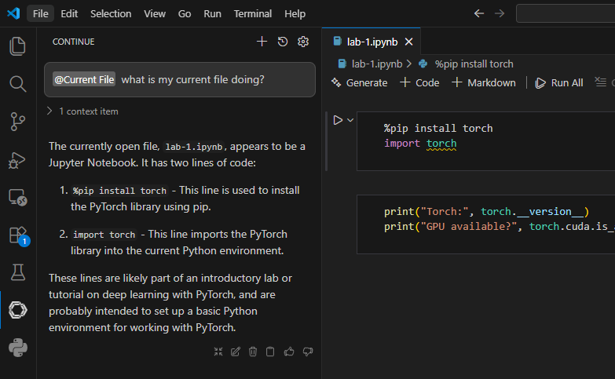

# Vibe Coding in VS Code

> Use DGX Spark as a local or remote Vibe Coding assistant with Ollama and Continue

## Table of Contents

- [Overview](#overview)
  - [What You'll Accomplish](#what-youll-accomplish)
  - [Prerequisites](#prerequisites)
  - [Time & risk](#time-risk)
- [Instructions](#instructions)
- [Troubleshooting](#troubleshooting)

---

## Overview

## Basic idea

This playbook walks you through setting up **Dell GB10 (DGX Spark)** as a **Coding Assistant** — locally or as a remote coding companion for VSCode with Continue.dev.  
This guide uses **Ollama** with **Llama-3.2 3B** to provide easy deployment of a coding assistant to VSCode. Included is advanced instructions to allow DGX Spark and Ollama to provide the coding assistant to be available over your local network. This guide is also written on a **fresh installation** of the OS. If your OS is not freshly installed and you have issues, see the troubleshooting tab.

### What You'll Accomplish

You'll have a fully configured DGX Spark system capable of:

- Running local code assistance through Ollama.
- Serving models remotely for Continue and VSCode integration.
- Hosting large LLMs like GPT-OSS 120B using unified memory.

### Prerequisites

- DGX Spark (128GB unified memory recommended)
- **Ollama** and an LLM of your choice (e.g., `llama3.2:120b`)
- **VSCode**
- **Continue** VSCode extension
- Internet access for model downloads
- Basic familiarity with opening the Linux terminal, copying and pasting commands.
- Having sudo access.

### Time & risk

- **Duration:** About 30 minutes
- **Risks:** Data download slowness or failure due to network issues
- **Rollback:** No permanent system changes made during normal usage.

## Instructions

## Step 1. Access Spark from your Terminal

- Open VSCode
- Access Spark via VSCode's Remote Window from the previous lab

## Step 2. Install Ollama

- From your VSCode, open the Terminal by pressing ``Ctrl + ` ``

- Run the terminal in Bash mode

```
bash
```

- Install the latest version of Ollama using the following command:

```bash
curl -fsSL https://ollama.com/install.sh | sh
```

- Once the service is running, pull the desired model:

```bash
ollama pull llama3.2:3b
```

- After the model is pulled, open your terminal and run the following command to connect to the Ollama server via SSH tunneling as in the previous lab.

```bash
ssh -p 443 -L 11434:localhost:11434 aih@10.123.8.57
```

- Access Ollama server on your browser: [http://localhost:11434](http://localhost:11434)



## Step 3. Install Continue.dev Extension in VSCode

In your VSCode, install **Continue.dev** from the Marketplace:

- Go to **Extensions view** in VSCode
- Search for **Continue** published by [Continue.dev](https://www.continue.dev/) and install the extension

  

## Step 4. Local Ollama Inference Setup

- After installation, click on the Continue icon from side panel > Settings icon

  

- Locate the Configs icon > Open Configuration

  

- Replace the configuration with the following and `Ctrl + s` to save

```yaml
name: Local Config
version: 1.0.0
schema: v1
models:
  - name: llama3.2
    provider: ollama
    model: llama3.2:3b
    apiBase: http://localhost:11434
    title: llama3.2:3b
    roles:
      - chat
      - edit
      - autocomplete
```

## Let's Try It Out

- From Explorer, open **lab-1.ipynb** from the previous lab

  

- Navigate back to the chatbot console and Select Chat

  

- Select llama3.2 as your model

  

- Attach Context > Current File

  

- Provide a prompt

  

- Wait for the response



## Troubleshooting

| Symptom                                              | Cause                                      | Fix                                                                                                                                                                                                       |
| ---------------------------------------------------- | ------------------------------------------ | --------------------------------------------------------------------------------------------------------------------------------------------------------------------------------------------------------- |
| Ollama not starting                                  | GPU drivers may not be installed correctly | Run `nvidia-smi` in the terminal. If the command fails check DGX Dashboard for updates to your DGX Spark.                                                                                                 |
| Continue can't connect over the network              | Port 11434 may not be open or accessible   | Run command `ss -tuln \| grep 11434`. If the output does not reflect `tcp   LISTEN 0      4096               *:11434            *:* `, go back to step 2 and run the ufw command.                         |
| Continue can't detect a locally running Ollama model | Configuration not properly set or detected | Check `OLLAMA_HOST` and `OLLAMA_ORIGINS` in `/etc/systemd/system/ollama.service.d/override.conf` file. If `OLLAMA_HOST` and `OLLAMA_ORIGINS` are set correctly, add these lines to your `~/.bashrc` file. |
| High memory usage                                    | Model size too big                         | Confirm no other large models or containers are running with `nvidia-smi`. Use smaller models such as `gpt-oss:20b` for lightweight usage.                                                                |
