# Set Up Local Network Access

## Table of Contents

- [Overview](#overview)
- [Accessing DGX Spark via VS Code Remote Window](#accessing-dgx-spark-via-vs-code-remote-window)
- [Use SSH Tunneling for Web Applications](#use-ssh-tunneling-for-web-applications)
- [Troubleshooting](#troubleshooting)

---

## Overview

## Basic idea

If you primarily work on another system, such as a laptop, and want to use your **Dell GB10 (DGX Spark)** as a remote resource, this playbook shows you how to connect and work over SSH. With SSH, you can
securely open a terminal session or tunnel ports to access web apps and APIs on your DGX Spark
from your local machine.

## What you'll accomplish

For this lab, you will be accessing the DGX Spark via 2 approaches:

1. Use VSCode to directly access DGX Spark via VSCode's inbuilt Remote Window.
2. Map a port on your laptop to a port where an app on DGX Spark is listening. This method is also known as SSH tunneling.

These approaches will enable you to run terminal commands, access web applications and manage your DGX Spark remotely from your laptop.

## What to know before starting

- Basic terminal/command line usage
- Understanding of SSH concepts and key-based authentication
- Familiarity with network concepts like hostnames, IP addresses, and port forwarding

## Prerequisites

- Your DGX Spark [device is set up](https://docs.nvidia.com/dgx/dgx-spark/first-boot.html) and you have created a local user account
- You have your DGX Spark username and password
- You have your device's IP address
- VSCode installed in your local machine

## Time & risk

- **Time estimate:** 15-20 minutes
- **Risk level:** Low - SSH setup involves credential configuration but no system-level changes to the DGX Spark device
- **Rollback:** SSH key removal can be done by editing `~/.ssh/authorized_keys` on your DGX Spark.

## Accessing DGX Spark via VS Code Remote Window

## Step 1. Download and Install VSCode

This lab requires that you download and install VSCode in your laptop. VSCode will also be used in subsequent labs.

Download and install VSCode:

- https://code.visualstudio.com/download

## Step 2. Set up Remote Session from VSCode

After installing VSCode, follow the steps below to set up a remote session to DGX Spark.

- Launch VSCode
- On the console, open a remote window by clicking on 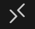 button
located at the bottom left corner of your screen

  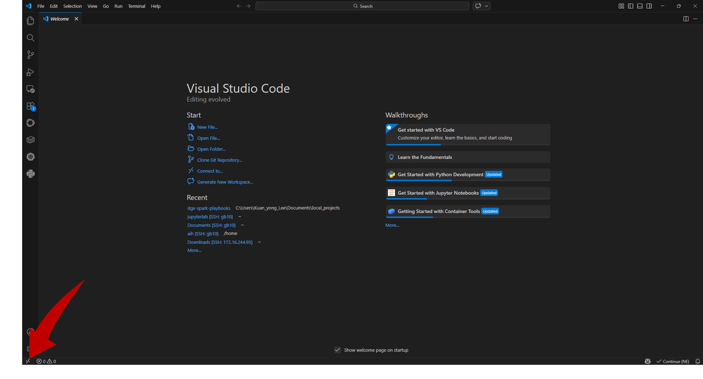

- A dropdown menu will be displayed. Click on **Connect Current Window to Host**

  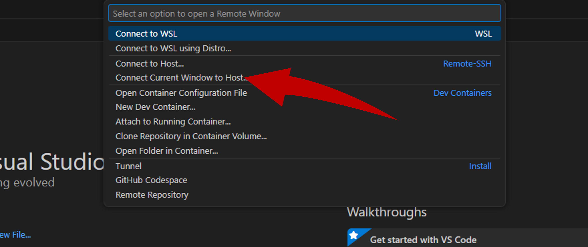

- Click **Add New SSH Host**

  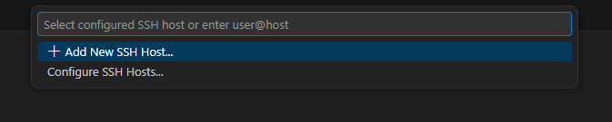

- From the input bar, enter the following ssh command

```bash
ssh -p 443 <SPARK_USER>@10.123.8.57
```

  

- Select the first option when prompted to save your configuration into your SSH configuration file

  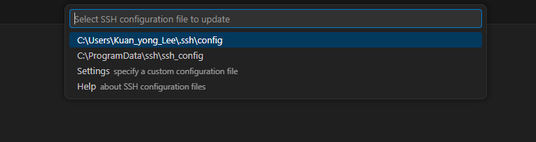

- A pop up will appear at the bottom right of the screen. Click **Open Config** to view the file.

  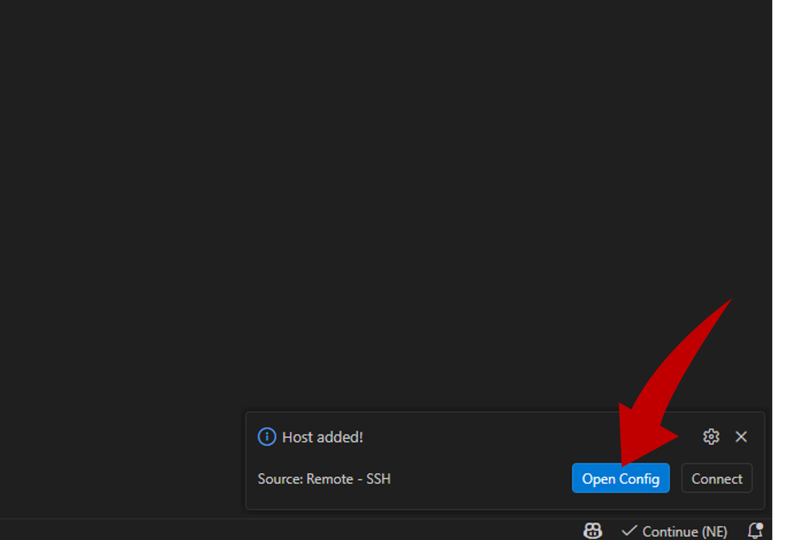

- This is the default configuration file that stores the ssh connections. You can manually add additional entries here as well.

  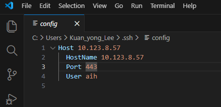

- Open the Remote Window again by clicking on  Button > Connect Current Window to Host > IP Address you have configured

  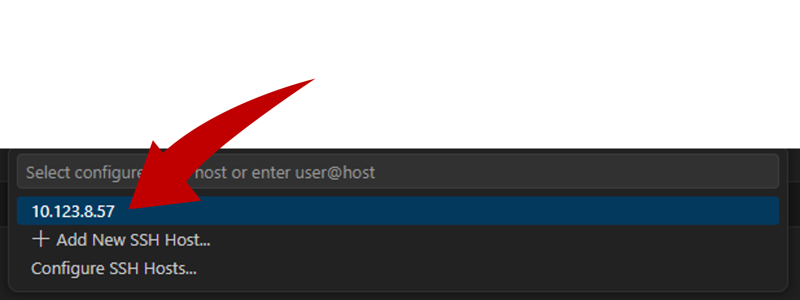

- Select **Linux** when prompted for the platform

  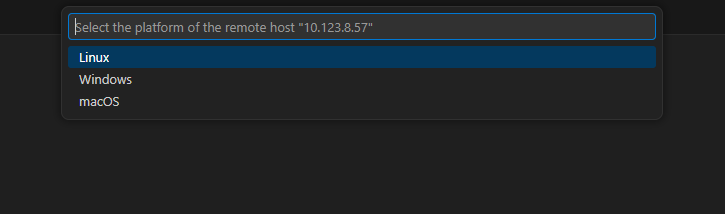

- Enter your user password when prompted

  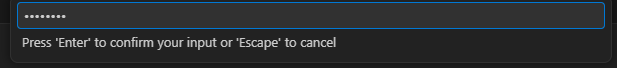

- The console will bring you into the DGX Spark. To confirm if you are inside DGX Spark, open the Terminal by entering ``Ctrl + ` ``. Your hostname should show **promaxgb10-60b9**

  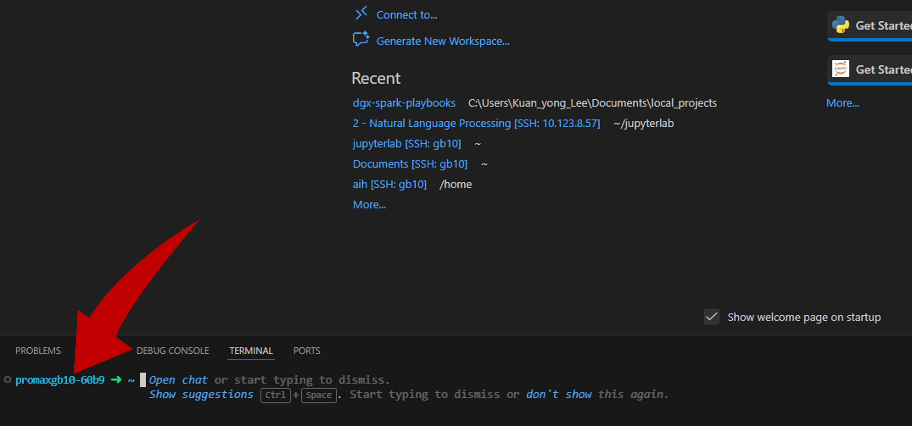

- We have prepared jupyterlab notebooks for you. Go to **Explorer > Open Folder > jupyterlab > OK**

  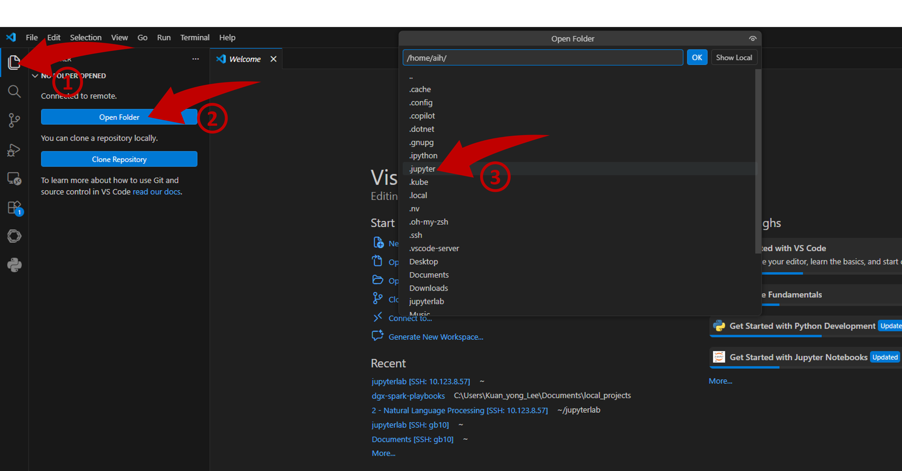

- This will pop up a new VSCode window. **Trust Folder & Continue > Enter password again when prompted**

  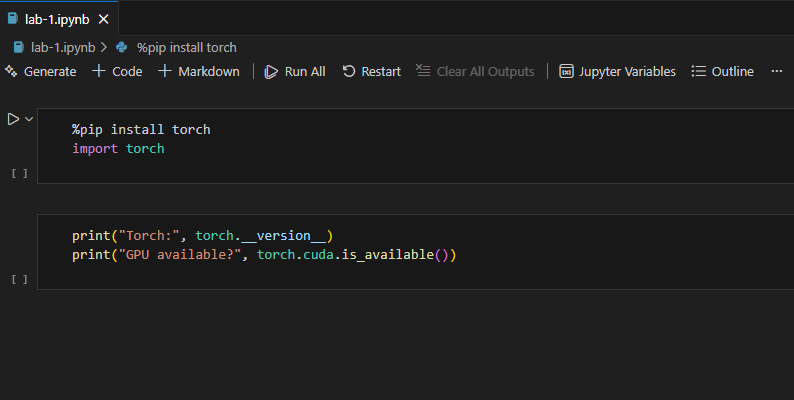

## Use SSH Tunneling for Web Applications

To access web applications running on your DGX Spark, use SSH port
forwarding. In this example we'll access the DGX Dashboard web application.

> [!NOTE]
> DGX Dashboard runs on localhost, port 11000.

Open the tunnel:

```bash
## local port 11000 → remote port 11000
ssh -p 443 -L 11000:localhost:11000 <YOUR_USERNAME>@<SPARK_IP_ADDRESS>
```

After establishing the tunnel, access the forwarded web app in your browser: [http://localhost:11000](http://localhost:11000)

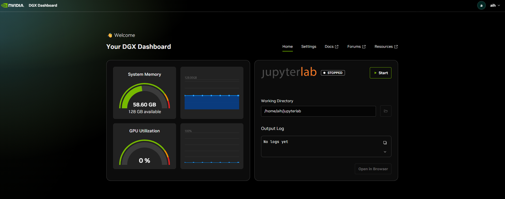

## Next steps

If mDNS is configured, you can:

- Open persistent terminal sessions: `ssh <YOUR_USERNAME>@<SPARK_HOSTNAME>.local`.
- Forward web application ports: `ssh -L <local_port>:localhost:<remote_port> <YOUR_USERNAME>@<SPARK_HOSTNAME>.local`.

## Troubleshooting

## Possible issues connecting via manual SSH

| Symptom                     | Cause                                 | Fix                                                                 |
| --------------------------- | ------------------------------------- | ------------------------------------------------------------------- |
| Device name doesn't resolve | mDNS blocked on network               | Use IP address instead of hostname.local                            |
| Connection refused/timeout  | DGX Spark not booted or SSH not ready | Wait for device boot completion; SSH available after updates finish |
| Port forwarding fails       | Service not running or port conflict  | Verify remote service is active; try different local port           |
